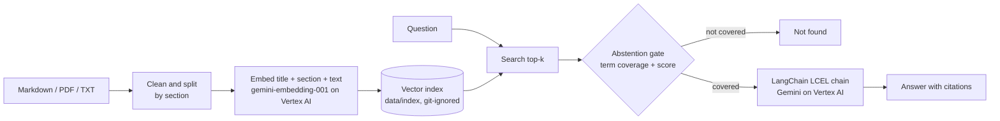

# Energy Docs RAG — question answering over solar plant project documentation

A retrieval-augmented generation (RAG) assistant for engineers working on utility-scale
solar PV plants, across the whole project life cycle: site studies, permitting,
civil works, construction, quality control, and operation and maintenance. Ask a
question in plain Spanish — *"¿qué se hace cuando un perfil da rechazo en la hinca?"*,
*"¿qué hago si salta un fallo de aislamiento en el inversor?"* — and get the relevant
passage back with a citation to the exact document and section, or an explicit
"not found" when the documents do not cover it.

Built on **Vertex AI** — `gemini-embedding-001` for retrieval and **Gemini** for the
answers — orchestrated with **LangChain**, served through **FastAPI** in **Docker**, and
**measured**: retrieval, section-level accuracy and abstention are evaluated against a
labelled question set on every run.

## About this repository and its data

> **This is a public reconstruction of a RAG system I built and run in production at a
> renewable energy company.** The production system is fed with that company's
> **private documentation** — geotechnical and topographic studies, permitting projects,
> civil and construction documents, quality inspection plans, O&M records — which is
> confidential and cannot be published.
>
> **Every document in this repository is fictional.** The corpus describes an invented
> plant, "Planta Fotovoltaica Los Almendros", with invented equipment brands, figures,
> dates, incidents and non-conformities, written from scratch so the system can be shown
> and evaluated in public. No company document was used, copied or paraphrased to write it.
>
> **The code was also written from scratch for this public version.** No code, prompts,
> configuration or data from the production system are included.
>
> The public regulation collection is Spanish legislation published in the BOE.

## Example

```text
$ energy-rag ask "¿Qué hago si salta un fallo de aislamiento en el inversor?" --top-k 2

[1] Códigos de alarma SCADA — Inversores y seguidores § E101 — Fallo de aislamiento DC
E101 — Fallo de aislamiento DC. La resistencia de aislamiento del campo fotovoltaico
respecto a tierra es inferior a 50 kΩ. [...] Actuación: 1. Verificar si la alarma aparece
solo por la mañana con rocío [...]

[2] Protocolo de pruebas de puesta en marcha § 2.3 Resistencia de aislamiento
[...] El valor mínimo aceptable es de 40 MΩ por string en la puesta en marcha. Este
criterio es más exigente que el umbral de alarma E101 del inversor [...]

$ energy-rag ask "¿Qué turbina eólica tiene la planta?"
No he encontrado información suficiente en los documentos indexados para responder a esta pregunta.
```

That output is the offline mode, which needs no credentials and returns the retrieved
passages verbatim. On the full stack (`EMBEDDING_BACKEND=vertex`, `LLM_BACKEND=vertex`),
retrieval runs on Vertex AI embeddings and Gemini writes the answer, citing the passages
as `[1]`, `[2]`.

## The corpus

17 fictional documents organised by project phase, written to cross-reference each other
the way real project documentation does. See [`corpus/README.md`](corpus/README.md).

| Phase | Documents |
|---|---|
| Site studies | Geotechnical study with pile test campaign; topographic and hydrological study |
| Engineering and permitting | Permitting project (*Proyecto Técnico Administrativo*, PTA); grid connection requirements |
| Construction | Civil works design report; pile driving procedure; commissioning test protocol |
| Quality | Inspection and test plans (PPI) for piling and structure, and for trenches and cabling; a non-conformity report |
| Operation and maintenance | O&M manual; inverter datasheet; SCADA alarm codes; tracker maintenance; module cleaning; an incident report; a monthly report |

The cross-references test retrieval on connections, not just keywords. The geotechnical
study recommends a follow-up survey in the north zone; the non-conformity NC-2023-041
records that it was skipped and the piles hit cemented gravel there. An incident in
operation traces blown fuses to badly crimped connectors, and the cabling PPI is revised
in response.

## How it works



## Results

Measured on the synthetic corpus (17 documents, 112 chunks) with the offline TF-IDF
backend, which is what CI runs because it needs no credentials. The same command
evaluates the Vertex AI stack once the index is built with it:
`EMBEDDING_BACKEND=vertex energy-rag ingest --collection plant-docs && energy-rag evaluate --detail`.

**Retrieval** — 38 questions. Is the document that answers the question in the top *k*,
and is the right *section* of it?

| Metric | @1 | @3 | @5 |
|---|---|---|---|
| Right document, strict labelling (one document per question) | 0.737 | 0.974 | 1.000 |
| Right document, multi-label (any document that states the answer) | **0.895** | **0.974** | **1.000** |
| Right section (29 questions with a clear answer section) | **0.759** | **0.897** | **0.966** |

MRR is 0.932 with multi-label and 0.849 with strict labelling. Nine questions accept a
second document because the answer genuinely appears in both — the 60 km/h tracker stow
limit is in the tracker procedure and in the alarm codes, the drainage return period in
the hydrological study and in the civil works report — and strict labelling counted
those correct retrievals as misses. Each case was checked against the text.

**Abstention** — does it refuse when the corpus has no answer?

| Metric | Result |
|---|---|
| Unanswerable questions correctly refused | 7 / 10 |
| Answerable questions wrongly refused | 0 / 38 |

The three misses are deliberately near-domain and built only from words the corpus does
contain: *"¿qué dice el plan de seguridad y salud sobre los trabajos en altura?"*,
*"¿cuántos trabajadores había en obra en el pico de la construcción?"*, *"¿qué garantía
tienen las baterías?"*. No lexical signal can tell that those documents are missing;
they are left to the generation prompt, which tells the model to say when the excerpts
do not contain the answer.

**Caveats, stated plainly.** The corpus is small and the questions were written by the
same person who built the retriever, so these numbers are optimistic. They exist to catch
regressions and to make design decisions on evidence, as below — not to claim production
accuracy.

## What the measurements changed

Every decision below was made by running the evaluation, not by intuition, on the
offline backend so each change could be measured in seconds. Two of my hypotheses turned
out to be wrong.

**1. Abstention by similarity score did not work.** The first version refused to answer
when the best cosine score was low. Measured, *"¿cuál es la receta del pulpo a la
gallega?"* scored 0.63, higher than some correct answers. The gate now also checks
**term coverage**: the fraction of the question's content words that exist anywhere in
the corpus. Every answerable question scores ≥ 0.60 and the refused ones ≤ 0.33; the
threshold is set at 0.35 from that gap.

**2. Doubling the corpus degraded everything — and showed why.** Going from 9 to 17
documents dropped recall@1 from 0.95 to 0.82, left one question not found at all, and
cut abstention from 7/8 to 6/10. More documents mean more shared vocabulary, which is
exactly what a production corpus of hundreds of documents looks like. The unfound
question was about the revision history of the cabling inspection plan, a section that
never contains the word "cableado" — only the document title does. **Prefixing every
chunk with its document title** before embedding brought recall@1 back to 0.895. Missing
Spanish stopwords ("quién", "había", "dice") were inflating coverage on off-topic
questions; fixing the list restored abstention to 7/10.

**3. Wrong hypothesis: "the title prefix will hurt section ranking."** For short sections
the title could outweigh the content, so I expected it to help find the document but not
the section. I labelled the answer section for 29 questions and measured title weights
from 0 to 1. The full prefix was best on both: section@1 rose from 0.59 without the
title to 0.76 with it.

**4. Wrong hypothesis: "IDF-weighted coverage will abstain better."** Weighting each word
by how rare it is in the corpus seemed the obvious fix for near-domain questions. It
caught the same 7/10 with a narrower safety margin, so the simpler version stayed.

## Design decisions

**Chunking by section.** Markdown is split on its headings first, then long sections into
~1,200-character windows with 200 characters of overlap, cut on sentence boundaries.
The section heading is kept in the chunk, so a question about "E101" or "backtracking"
matches the heading, and the citation reads *"Códigos de alarma § E101"* instead of
*"chunk 17"*. PDFs keep page numbers, and the headers BOE repeats on every page are
stripped.

**Vertex AI embeddings, used the way the model expects.** Chunks are embedded with
`gemini-embedding-001` using the `RETRIEVAL_DOCUMENT` task type and questions with
`RETRIEVAL_QUERY`; the model is trained to place a question near the passages that answer
it when told which is which. Output is truncated to 768 dimensions, which the model
supports, to keep the index small. Embeddings are computed once at ingestion and stored
in the index, so a question costs one embedding call. Semantic embeddings match
paraphrases a word-count method misses — *"lavar los paneles"* against *"limpieza de
módulos"* — which is what real users type.

**Off the deprecated SDK path.** LangChain's `VertexAIEmbeddings` and `ChatVertexAI` are
deprecated and scheduled for removal, so the project uses their replacement,
`langchain-google-genai`, with `vertexai=True`. Calls still go to Vertex AI: the Google
Cloud project, IAM and the regional endpoint are unchanged. Model IDs are environment
variables because Google retires versions on a schedule.

**An offline mode for tests and CI.** `tfidf` (TF-IDF + truncated SVD) needs no
credentials, no network and no model download, and is deterministic, so the test suite
and the evaluation run anywhere. The Vertex AI backend is tested with a fake client that
also checks the correct task type is sent for documents and for questions.

**LangChain where it earns its place.** Retrieval and abstention are this project's own
code, because they are what the evaluation measures and they must be inspectable.
LangChain provides the Vertex AI clients, the retriever interface and the LCEL chain over
the chat model.

**FAISS only when it helps.** For a few thousand chunks a NumPy dot product is faster than
building an index; FAISS is used automatically above 1,000 chunks, if installed.

## Quickstart

```bash
git clone https://github.com/<your-user>/energy-docs-rag.git
cd energy-docs-rag
python -m venv .venv && source .venv/bin/activate
pip install -r requirements.txt -r requirements-optional.txt && pip install -e .
```

### Full stack on Vertex AI

```bash
gcloud auth application-default login
cp .env.example .env                 # set GOOGLE_CLOUD_PROJECT; the rest is preconfigured

energy-rag ingest --collection plant-docs    # embeds the corpus with gemini-embedding-001
energy-rag ask "¿Qué cambió en el PPI de cableado tras la incidencia de los fusibles?"
energy-rag evaluate --detail
```

Indexing the synthetic corpus is 112 embedding calls; each question is one embedding call
plus one Gemini call.

### Offline mode, no Google Cloud

```bash
EMBEDDING_BACKEND=tfidf LLM_BACKEND=extractive energy-rag ingest --collection plant-docs
EMBEDDING_BACKEND=tfidf LLM_BACKEND=extractive energy-rag ask "¿Qué es un punto de parada del PPI?"
```

`energy-rag ingest` without `--collection` also downloads and indexes the public BOE
regulation (Ley 24/2013, RD 413/2014, RD 244/2019, RD 1183/2020). `LLM_BACKEND=openai`
with `OPENAI_API_KEY` is also supported for generation.

### API and Docker

```bash
uvicorn energy_rag.api:app --reload
curl -X POST localhost:8000/ask -H 'Content-Type: application/json' \
     -d '{"question": "¿Qué condiciones impuso la declaración de impacto ambiental al vallado?"}'

docker build -t energy-docs-rag .            # offline index of the synthetic corpus, baked in
docker run --rm -p 8000:8000 energy-docs-rag

# Full stack: pass the project and mount your gcloud credentials, then re-index on Vertex AI
docker run --rm -p 8000:8000 --env-file .env \
  -v ~/.config/gcloud:/root/.config/gcloud:ro energy-docs-rag \
  sh -c "energy-rag ingest --collection plant-docs && uvicorn energy_rag.api:app --host 0.0.0.0"
```

No credentials are baked into the image.

`GET /health` reports the number of indexed chunks and the active backends.

## Using your own private documents

This is how the production system works, and the reason the design is careful about it.
The vector index stores the **full text** of every chunk, so an index built from private
documents *is* those documents. Three things keep them out of version control:

1. **`data/` is git-ignored.** Private files go in `data/private/`; the index is written
   to `data/index/`.
2. **A privacy guard asks Git before writing.** Before saving an index or reading a
   private folder inside a Git working tree, the pipeline runs `git check-ignore` and
   refuses if the path could be committed:

   ```text
   $ energy-rag ingest --path ./exports
   Privacy check failed. Refusing to use ./exports for private documents: it is inside a
   Git repository and not ignored, so its contents could be committed. [...]
   ```

   The same applies if `INDEX_DIR` points somewhere tracked. Tests cover this inside a
   real temporary Git repository.
3. **Private documents are never baked into the Docker image.** The image indexes only
   the synthetic corpus; mount private folders at run time.

```bash
energy-rag ingest --collection plant-docs --path ~/Documents/project-docs
```

A folder outside the repository, like the one above, is always allowed.

## Project structure

```
src/energy_rag/
├── config.py      paths, chunking and retrieval constants, env-based settings
├── ingest.py      Markdown / PDF / TXT loading, section-aware chunking, BOE download
├── embeddings.py  Vertex AI, TF-IDF and sentence-transformers behind one interface
├── store.py       vector store, cosine search, optional FAISS, save / load
├── text.py        Spanish normalisation and term coverage for the abstention gate
├── rag.py         retrieval, abstention, extractive answers
├── chain.py       LangChain retriever, LCEL chain, Gemini on Vertex AI
├── privacy.py     git-ignore guard for private documents and the index
├── evaluate.py    document recall, section accuracy, MRR, abstention
├── api.py         FastAPI service
└── cli.py         energy-rag ingest | ask | evaluate
corpus/            17 fictional documents of an invented 50 MWp PV plant, by project phase
config/sources.yaml  document collections to index
eval/questions.yaml  labelled questions, answer sections, and questions to refuse
tests/             32 tests, no network and no credentials
```

## Tests

```bash
pip install -r requirements-dev.txt
PYTHONPATH=src pytest tests -q
```

The suite covers cleaning, section chunking, title-prefixed embeddings, retrieval across
all project phases, citations, abstention, index persistence, the Vertex AI embedding
backend (with a fake client that checks the retrieval task types), the LangChain chain
(with a fake chat model), the evaluation metrics, a regression floor on the shipped
question set, and the privacy guard inside a real temporary Git repository. Tests always
run offline, even when `.env` selects Vertex AI.

## Limitations and next steps

- **Section ranking is the weakest point: 76 % right at rank 1.** For example, asked what
  to do when a pile hits refusal, the system finds the right procedure but ranks its
  "Replanteo" section above the "Rechazo" one. A cross-encoder reranker over the top 20
  chunks is the next step, and the section labels are in place to measure it.
- **Near-domain questions pass the abstention gate** (3 of 10 in the evaluation) and rely
  on the language model to decline.
- **Tables are flattened to text.** Values in tables are retrievable, but row and column
  structure is lost.
- **No conversation memory**, and **the index is a snapshot**: nothing warns you when a
  source document changes.
- **Model versions expire.** Defaults are `gemini-2.5-flash` and `gemini-embedding-001`;
  set `VERTEX_MODEL` / `VERTEX_EMBEDDING_MODEL` when Google retires them. Changing the
  embedding model requires re-running `ingest`, and the CLI warns when the index and the
  configured backend disagree.

## License

MIT — see [LICENSE](LICENSE). The synthetic corpus is part of this repository under the
same license. BOE documents are public legislation downloaded from boe.es, not
redistributed.
